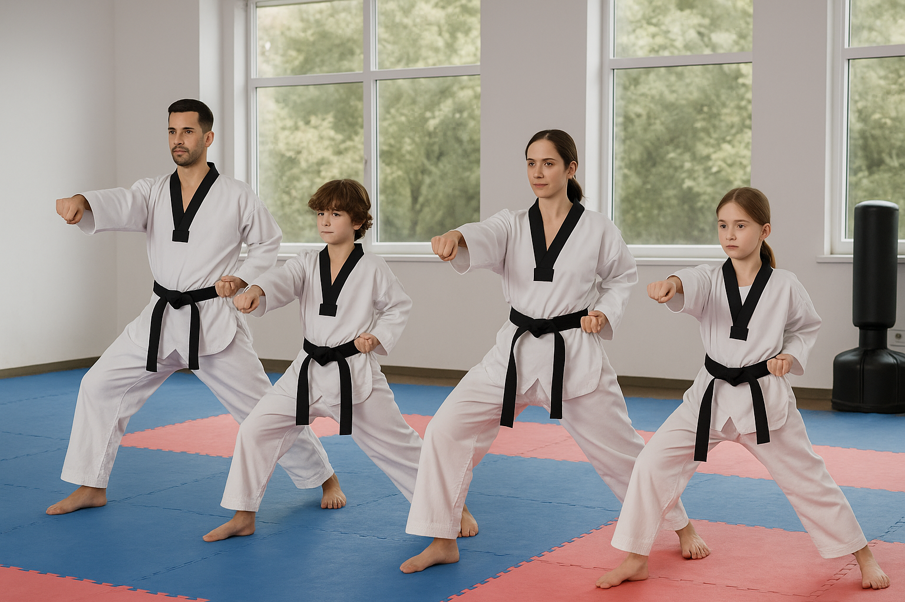

import imageLeslieAlexander from '@/images/team/leslie-alexander.jpg'

export const article = {
  date: '2025-06-16',
  title: 'How Taekwondo Builds Stronger Family Bonds',
  description:
    'Discover how practicing Taekwondo as a family creates connection, builds discipline, and turns time together into something powerful.',
  author: {
    name: 'Robert Von Der Becke',
    role: 'Co-Founder / Head Instructor',
    image: { src: imageLeslieAlexander },
  },
}

export const metadata = {
  title: article.title,
  description: article.description,
}

## 1. Shared Discipline, Shared Growth

One of the most unique aspects of Taekwondo is that people of all ages and experience levels can train side by side. When families attend class together, they face challenges together—whether it's memorizing forms, improving flexibility, or earning their next belt.

The rituals of bowing in, practicing drills, and setting goals create a shared rhythm and sense of accountability. This helps family members build mutual respect and learn to encourage one another in a healthy, structured environment.

<TopTip>
  Parents: Let your kids lead warmups sometimes! It builds confidence and flips the script in a fun way.
</TopTip>

## 2. Screen-Free, Purposeful Time Together

In a world of digital overload, quality time that doesn’t revolve around screens is rare. Taekwondo provides that opportunity. It’s an hour or more where the focus is completely physical, mental, and emotional—with no distractions.

This leads to better in-person communication, stronger emotional awareness, and deeper trust between parents and children.

## 3. It Fosters a Family Identity

Just like sports teams or scout troops, families who train together develop their own sense of identity and pride. Wearing the same uniform, cheering each other on at belt tests, and even breaking boards side-by-side gives your family a story—one that says, *we don’t quit, we grow together.*

It’s common for families who start together to continue training for years, building traditions and shared memories that extend far beyond the dojang.

---

Practicing Taekwondo as a family isn’t just about self-defense—it’s about self-discovery, together. Whether you're aiming to build confidence, improve fitness, or just spend more meaningful time with your kids, this martial art offers a foundation that grows with you.

